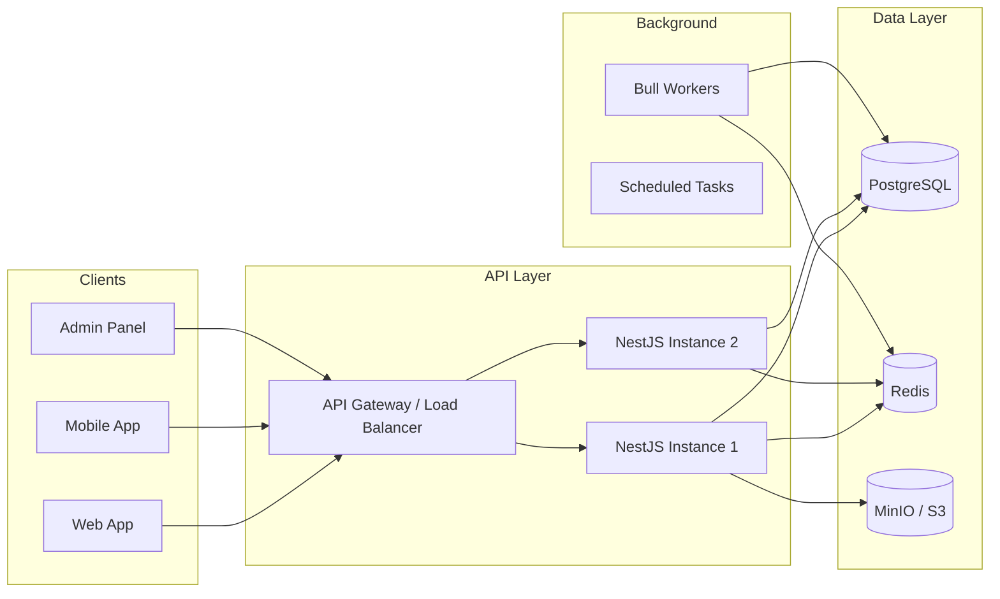
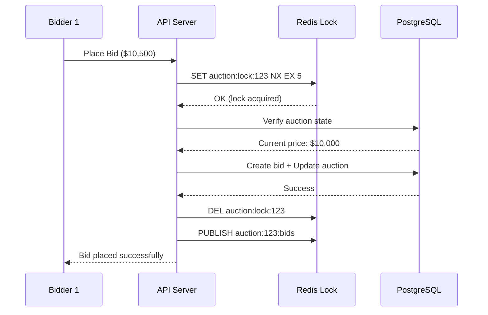
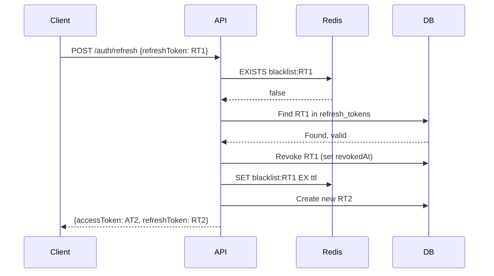
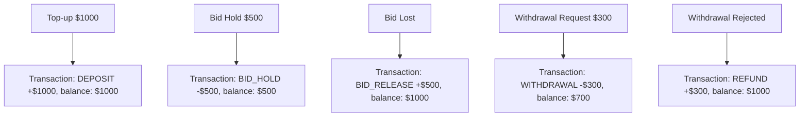
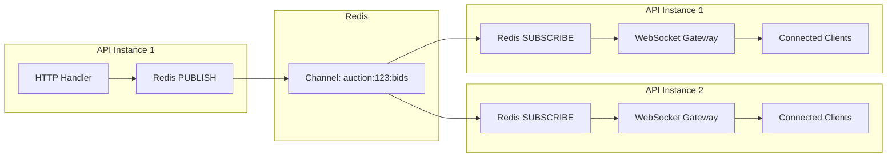

# Architecture Documentation

## System Design Overview

This document describes the architectural decisions, patterns, and trade-offs made in the Vehicle Marketplace API.

---

## High-Level Architecture



---

## Design Decisions

### 1. Fastify over Express

**Decision**: Use `@nestjs/platform-fastify` instead of the default Express adapter.

**Why**:
- 2x higher throughput in benchmarks
- Better JSON serialization performance
- Schema-based validation at the framework level
- Lower memory overhead

**Trade-off**: Slightly different middleware API, some Express-specific packages need alternatives.

---

### 2. PostgreSQL Full-Text Search over Elasticsearch

**Decision**: Use PostgreSQL's native `tsvector`/`tsquery` for search instead of a dedicated search engine.

**Why**:
- No additional infrastructure to maintain
- Good enough for marketplace search volumes
- Reduces deployment complexity
- Built-in ranking with `ts_rank`

**Trade-off**: Less powerful than Elasticsearch for complex queries, no fuzzy matching out-of-the-box. Can be upgraded later if needed.

---

### 3. Redis for Multiple Concerns

**Decision**: Use a single Redis instance for caching, Pub/Sub, rate limiting, session management, and queue backing.

**Why**:
- Redis excels at all these use cases
- Reduces infrastructure components
- Sub-millisecond latency
- Built-in data structures (sorted sets, hashes, pub/sub)

**Namespacing Strategy**:
```
otp:{phone}           - OTP codes
blacklist:{token}     - Revoked tokens
unread:{userId}       - Unread message counts per room
auction:lock:{id}     - Distributed locks for bidding
```

---

### 4. Distributed Locking for Auction Bids

**Decision**: Use Redis `SET NX EX` for optimistic locking on bid placement.



**Why**:
- Prevents double-spend / race conditions
- Much simpler than database-level locking
- 5-second TTL prevents deadlocks
- Works across multiple API instances

---

### 5. Bull Queue for Auction Lifecycle

**Decision**: Use Bull (backed by Redis) for scheduled auction operations.

**Why**:
- Reliable delayed job execution
- Automatic retries on failure
- Dashboard available (Bull Board)
- Same Redis instance, no new infrastructure

**Jobs**:
- `start-auction`: Transitions auction from SCHEDULED → ACTIVE
- `end-auction`: Auto-closes auction, determines winner, updates vehicle status

---

### 6. JWT with Refresh Token Rotation

**Decision**: Short-lived access tokens (15m) + long-lived refresh tokens (7d) with rotation.



**Why**:
- Short access tokens limit damage from theft
- Rotation detects token reuse (stolen refresh token)
- Redis blacklist enables instant revocation
- Stateless verification for access tokens (no DB hit on every request)

---

### 7. Double-Entry Wallet Pattern

**Decision**: Every wallet operation records both the transaction and the resulting balance.



**Why**:
- Full audit trail of every money movement
- Balance at any point in time is reconstructable
- Prevents balance inconsistencies
- Required for financial compliance

---

### 8. Module-Based Architecture

**Decision**: Feature-based module organization with clear boundaries.

```
src/modules/
├── auth/        → Owns: authentication, tokens, OTP
├── users/       → Owns: profiles, avatars
├── vehicles/    → Owns: listings, images
├── auctions/    → Owns: bidding, lifecycle
├── chat/        → Owns: messaging, rooms
├── wallet/      → Owns: balance, transactions
├── notifications/ → Owns: alerts, delivery
├── admin/       → Owns: moderation, audit
├── search/      → Owns: full-text search
└── health/      → Owns: health checks
```

**Why**:
- Each module is independently testable
- Clear ownership and boundaries
- Easy to extract into microservices later
- NestJS DI system enforces module boundaries

---

### 9. Real-time Event Flow



**Why**:
- Works with horizontal scaling (multiple instances)
- Redis Pub/Sub is fire-and-forget (fast)
- Socket.io rooms handle client targeting
- Decouples HTTP handlers from WebSocket delivery

---

## Security Measures

1. **Helmet** - Security headers (XSS protection, HSTS, etc.)
2. **Rate Limiting** - Redis-backed, per-IP throttling
3. **Input Validation** - class-validator on all DTOs
4. **SQL Injection** - Prisma's parameterized queries
5. **JWT** - Short-lived tokens, rotation, blacklisting
6. **CORS** - Configurable allowed origins
7. **File Upload** - Type validation, size limits
8. **Audit Logging** - All admin actions logged

---

## Scalability Considerations

- **Horizontal**: Stateless API + Redis Pub/Sub allows N instances
- **Database**: Read replicas for queries, connection pooling via Prisma
- **Caching**: Redis cache layer for hot data (vehicle details, auction state)
- **Storage**: MinIO/S3 for unlimited object storage
- **Queue**: Bull workers can scale independently

---

## Monitoring

- `/health` - Basic liveness check (database + Redis)
- `/ready` - Readiness probe (all dependencies)
- `/metrics` - Prometheus format metrics
  - `http_request_duration_seconds` - Request latency histogram
  - `http_requests_total` - Request counter by method/route/status
  - Default Node.js metrics (memory, CPU, event loop lag)
