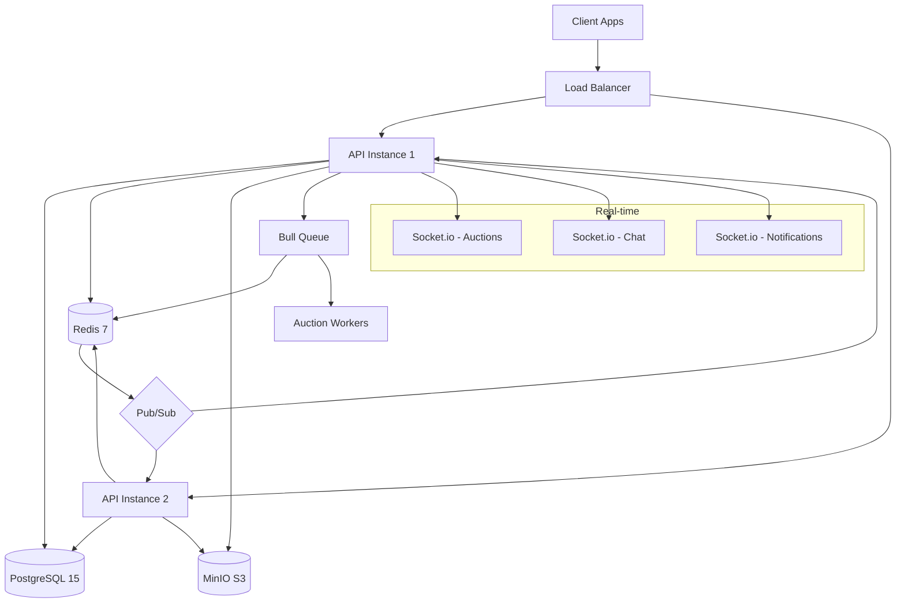

# 🚗 Vehicle Marketplace API

> Production-grade RESTful API for a Vehicle Marketplace with Real-time Auctions, built with NestJS, Fastify, PostgreSQL, Redis, and Socket.io.

[](https://github.com/engmhisham/vehicle-marketplace-api/actions)
[](https://www.typescriptlang.org/)
[](https://nestjs.com/)
[](https://www.postgresql.org/)
[](https://redis.io/)
[](https://opensource.org/licenses/MIT)

---

## 📋 Table of Contents

- [Overview](#overview)
- [Architecture](#architecture)
- [Tech Stack](#tech-stack)
- [Features](#features)
- [Getting Started](#getting-started)
- [API Documentation](#api-documentation)
- [Environment Variables](#environment-variables)
- [Testing](#testing)
- [Deployment](#deployment)
- [Project Structure](#project-structure)
- [Contributing](#contributing)

---

## Overview

A full-featured vehicle marketplace platform that enables dealers to list vehicles, create auctions with real-time bidding, and facilitates buyer-seller communication. Built with enterprise-grade patterns including RBAC, double-entry accounting wallet system, and comprehensive audit logging.

### Key Highlights

- **Real-time Auctions** with WebSocket bidding, Redis Pub/Sub for multi-instance support, and distributed locks for race condition prevention
- **OTP-based Authentication** with JWT access/refresh token rotation and Redis token blacklisting
- **Multi-tenant Architecture** with Role-Based Access Control (Buyer, Dealer, Admin)
- **S3-Compatible Storage** via MinIO for vehicle images with signed URLs
- **Full-text Search** using PostgreSQL's built-in tsvector/tsquery
- **Double-entry Wallet System** with transaction ledger and withdrawal management
- **Production-ready** with health checks, Prometheus metrics, rate limiting, and structured logging

---

## Architecture



---

## Tech Stack

| Category | Technology | Justification |
|----------|-----------|---------------|
| **Framework** | NestJS + Fastify | Enterprise architecture, 2x faster than Express |
| **Language** | TypeScript (Strict) | Type safety, better DX, fewer runtime errors |
| **Database** | PostgreSQL 15 | ACID compliance, full-text search, JSON support |
| **ORM** | Prisma | Type-safe queries, migrations, great DX |
| **Cache/Pub-Sub** | Redis 7 | Sub-ms latency, built-in Pub/Sub, locks |
| **Real-time** | Socket.io | Fallback transports, room-based broadcasting |
| **Storage** | MinIO (S3) | Self-hosted, no cloud costs, production-compatible |
| **Auth** | JWT + Passport | Stateless, scalable, industry standard |
| **Queue** | Bull (Redis) | Reliable job processing, delayed jobs, retries |
| **Validation** | class-validator | Decorator-based, integrates with NestJS pipes |
| **Docs** | Swagger/OpenAPI | Auto-generated, interactive API explorer |
| **Testing** | Jest | Fast, great mocking, coverage reports |
| **Container** | Docker Compose | One-command local environment |
| **Metrics** | Prometheus | Industry standard, Grafana-compatible |
| **Logging** | Winston | Structured logging, multiple transports |

---

## Features

### Authentication & Authorization
- Phone number registration with OTP verification (mock SMS)
- JWT access tokens (15m) + refresh tokens (7d) with rotation
- Redis-based token blacklisting for instant revocation
- Password reset via OTP
- Role-based access control (BUYER, DEALER, ADMIN)

### Vehicle Management
- Full CRUD with ownership enforcement
- Multi-image upload to MinIO with signed URLs
- Advanced filtering (make, model, year range, price range, condition, fuel type)
- Pagination with configurable page size
- Vehicle status workflow (Draft → Published → In Auction → Sold/Archived)

### Real-time Auctions
- Create auctions with configurable start/end times and bid increments
- WebSocket-based live bidding with instant broadcasts
- Redis distributed locks to prevent race conditions
- Redis Pub/Sub for multi-server instance support
- Bull Queue for auto-closing auctions at end time
- Bid history with pagination

### Chat System
- Buyer-seller messaging with optional vehicle context
- Real-time delivery via Socket.io
- Redis-backed unread message counters
- Read receipts with typing indicators
- Message history with pagination

### Wallet & Payments
- User wallet with balance management
- Mock payment gateway for top-ups
- Withdrawal requests with admin approval workflow
- Transaction ledger (double-entry style)
- Refund handling for rejected withdrawals

### Notifications
- In-app notification system with multiple types
- WebSocket delivery for real-time notifications
- Mark as read (individual and bulk)
- Unread count endpoint

### Admin Dashboard
- Stats and metrics (users, vehicles, auctions, revenue)
- User management (list, suspend, activate, change roles)
- Vehicle moderation (approve/reject listings)
- Comprehensive audit logs

### Search
- PostgreSQL full-text search with ranking
- Autocomplete suggestions
- Indexed on make, model, description, location

---

## Getting Started

### Prerequisites

- **Node.js** >= 18
- **Docker** & **Docker Compose**
- **Git**

### Quick Start (Docker)

```bash
# Clone the repository
git clone https://github.com/engmhisham/vehicle-marketplace-api.git
cd vehicle-marketplace-api

# Copy environment file
cp .env.example .env

# Start all services (PostgreSQL, Redis, MinIO, API)
docker-compose up -d

# Run database migrations
docker exec vehicle-marketplace-api npx prisma migrate deploy

# Seed the database (optional)
docker exec vehicle-marketplace-api npm run prisma:seed

# API is now running at http://localhost:3000
# Swagger docs at http://localhost:3000/api/docs
# MinIO console at http://localhost:9001 (minio_access_key / minio_secret_key)
```

### Local Development (without Docker)

```bash
# Install dependencies
npm install

# Start PostgreSQL, Redis, MinIO via Docker (services only)
docker-compose up -d postgres redis minio createbucket

# Copy and configure environment
cp .env.example .env

# Generate Prisma client
npm run prisma:generate

# Run migrations
npm run prisma:migrate

# Seed database (optional)
npm run prisma:seed

# Start in development mode
npm run start:dev
```

---

## API Documentation

Interactive Swagger UI is available at: `http://localhost:3000/api/docs`

### Key Endpoints

| Method | Endpoint | Description | Auth |
|--------|----------|-------------|------|
| POST | `/api/v1/auth/register` | Register with phone | Public |
| POST | `/api/v1/auth/verify-otp` | Verify OTP | Public |
| POST | `/api/v1/auth/login` | Login | Public |
| POST | `/api/v1/auth/refresh` | Refresh tokens | Public |
| GET | `/api/v1/users/me` | Get profile | JWT |
| PUT | `/api/v1/users/me` | Update profile | JWT |
| GET | `/api/v1/vehicles` | List vehicles | Public |
| POST | `/api/v1/vehicles` | Create vehicle | Dealer |
| GET | `/api/v1/auctions` | List auctions | Public |
| POST | `/api/v1/auctions/:id/bid` | Place bid | JWT |
| POST | `/api/v1/chat/messages` | Send message | JWT |
| GET | `/api/v1/wallet/balance` | Get balance | JWT |
| POST | `/api/v1/wallet/top-up` | Top up wallet | JWT |
| GET | `/api/v1/admin/dashboard` | Dashboard stats | Admin |
| GET | `/api/v1/search/vehicles?q=` | Full-text search | Public |
| GET | `/api/v1/health` | Health check | Public |
| GET | `/metrics` | Prometheus metrics | Public |

### WebSocket Namespaces

- `/auctions` - Real-time bid updates
- `/chat` - Messaging
- `/notifications` - Push notifications

---

## Environment Variables

| Variable | Description | Default |
|----------|-------------|---------|
| `NODE_ENV` | Environment | `development` |
| `PORT` | Server port | `3000` |
| `DATABASE_URL` | PostgreSQL connection string | - |
| `REDIS_HOST` | Redis host | `localhost` |
| `REDIS_PORT` | Redis port | `6379` |
| `REDIS_PASSWORD` | Redis password | - |
| `JWT_ACCESS_SECRET` | JWT access token secret | - |
| `JWT_ACCESS_EXPIRATION` | Access token TTL | `15m` |
| `JWT_REFRESH_SECRET` | JWT refresh token secret | - |
| `JWT_REFRESH_EXPIRATION` | Refresh token TTL | `7d` |
| `MINIO_ENDPOINT` | MinIO host | `localhost` |
| `MINIO_PORT` | MinIO port | `9000` |
| `MINIO_ACCESS_KEY` | MinIO access key | - |
| `MINIO_SECRET_KEY` | MinIO secret key | - |
| `MINIO_BUCKET` | Storage bucket name | `vehicle-marketplace` |
| `THROTTLE_TTL` | Rate limit window (seconds) | `60` |
| `THROTTLE_LIMIT` | Max requests per window | `100` |

---

## Testing

```bash
# Unit tests
npm run test

# Unit tests with coverage
npm run test:cov

# E2E tests (requires running services)
npm run test:e2e

# Watch mode
npm run test:watch
```

### Test Coverage Target: >70%

The test suite covers:
- **Unit Tests**: Service layer logic, guards, interceptors
- **Integration Tests**: Auth flow, bidding logic, wallet operations
- **E2E Tests**: Full HTTP request/response cycles

---

## Deployment

### Railway (Recommended - Free tier available)

1. Push code to GitHub
2. Go to [railway.app](https://railway.app)
3. Create new project → Deploy from GitHub repo
4. Add services: PostgreSQL, Redis
5. Set environment variables from `.env.example`
6. Railway auto-detects Dockerfile and deploys

### Render

1. Create Web Service from GitHub repo
2. Set build command: `npm install && npx prisma generate && npm run build`
3. Set start command: `npm run start:prod`
4. Add PostgreSQL and Redis add-ons
5. Configure environment variables

### Docker (VPS)

```bash
# Build and run
docker-compose -f docker-compose.yml up -d --build

# Run migrations in production
docker exec vehicle-marketplace-api npx prisma migrate deploy
```

---

## Project Structure

```
vehicle-marketplace-api/
├── src/
│   ├── modules/
│   │   ├── auth/          # Authentication & OTP
│   │   ├── users/         # User management
│   │   ├── vehicles/      # Vehicle CRUD & images
│   │   ├── auctions/      # Real-time auctions
│   │   ├── chat/          # Messaging system
│   │   ├── wallet/        # Payment & transactions
│   │   ├── notifications/ # In-app notifications
│   │   ├── admin/         # Admin dashboard
│   │   ├── search/        # Full-text search
│   │   └── health/        # Health checks
│   ├── common/
│   │   ├── decorators/    # Custom decorators
│   │   ├── filters/       # Exception filters
│   │   ├── guards/        # Auth & role guards
│   │   ├── interceptors/  # Response & logging
│   │   ├── pipes/         # Validation pipes
│   │   ├── middleware/    # Metrics middleware
│   │   └── dto/           # Shared DTOs
│   ├── config/            # App configuration
│   ├── database/          # Prisma service
│   ├── redis/             # Redis service
│   ├── storage/           # MinIO service
│   ├── app.module.ts      # Root module
│   └── main.ts            # Bootstrap
├── prisma/
│   ├── schema.prisma      # Database schema
│   └── seed.ts            # Database seeder
├── test/                  # E2E tests
├── docker-compose.yml     # Local infrastructure
├── Dockerfile             # Production image
└── .github/workflows/     # CI/CD pipeline
```

---

## Contributing

See [CONTRIBUTING.md](./CONTRIBUTING.md) for guidelines.

---

## License

This project is [MIT](./LICENSE) licensed.

---

## Future Improvements

- Sentry error tracking integration
- Email notifications (SendGrid/Mailgun)
- Vehicle price history and analytics
- Elasticsearch for advanced search
- GraphQL API layer
- Mobile push notifications (FCM/APNs)
- Payment gateway integration (Stripe/PayMob)
- Image optimization pipeline (Sharp)
- CDN for static assets
- Kubernetes deployment manifests
